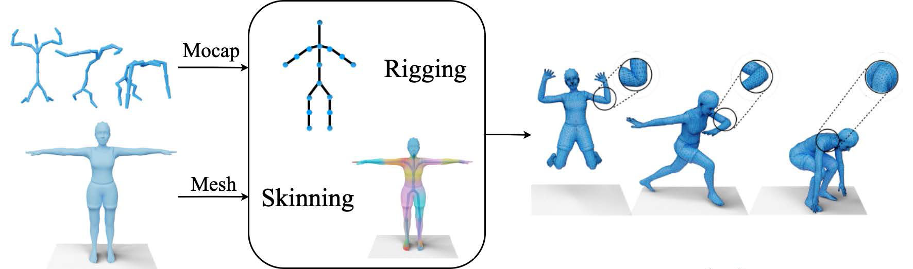

This project is to mesh a model with SMPL model based on the motion capture data from [CMU MoCap](http://mocap.cs.cmu.edu/) dataset.

A lightweight implmentation can be found on [github](https://github.com/CalciferZh/SMPL-AMC-Imitator), and I have outlined a Chinese notation for the objects in main codes. 

**Note:**

1. You can download the pdf version [Appendix.pdf](./Appendix.pdf).
2. I have uploaded a [report](./Report_MoCap_data_decorated_with_SMPL.pdf) on the project.

